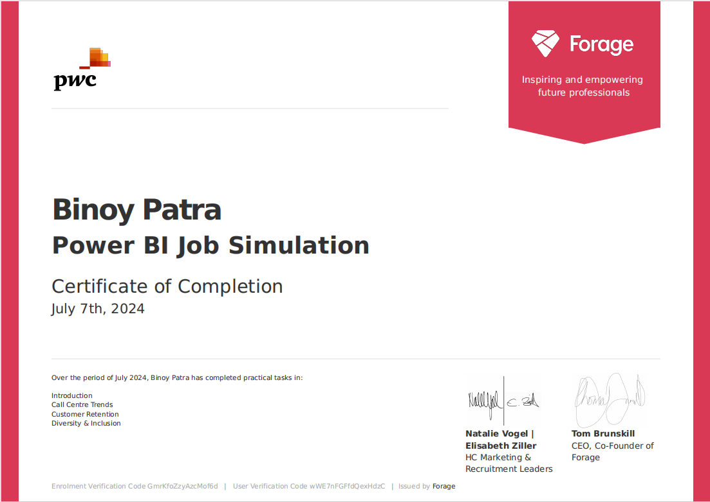

# PwC Switzerland Power BI Job Simulation on Forage - July 2024

## Introduction
I recently completed the PwC Switzerland Power BI Job Simulation on Forage in July 2024, where I honed my Power BI skills to better understand and meet clients' data visualization needs. Through this program, I developed three distinct dashboards, each addressing specific business problems. These projects allowed me to showcase my ability to analyze data, communicate insights effectively, and provide actionable recommendations.

## Problem Statements

### 1. Customer Retention Dashboard
**Problem:** The telecom retention department faced challenges in identifying customers at risk of terminating their contracts proactively. Historical analysis in Excel often ended in dead-ends, necessitating a clear and self-explanatory visualization for management.  
**Solution:** Created a Power BI dashboard to highlight customers at risk of churn, enabling proactive retention efforts through clear visual indicators and predictive metrics.

### 2. Call Centre Dashboard
**Problem:** The client needed a comprehensive view of call center performance, including overall customer satisfaction, call handling metrics, and agent performance, to improve service quality and operational efficiency.  
**Solution:** Developed a Power BI dashboard that visualized key performance indicators such as call volume, average speed of answer, customer satisfaction scores, and agent performance quadrants.

### 3. Diversity and Inclusion Dashboard
**Problem:** The telecom client's HR department struggled to improve gender balance at the executive management level and needed insights into hiring, promotion, performance, and turnover metrics to drive strategic initiatives.  
**Solution:** Designed a Power BI dashboard to track diversity-related KPIs, providing a detailed analysis of gender balance, promotion rates, hiring trends, and performance ratings, along with root cause analysis for slow progress in gender balance.

## Tools Used
- **Power BI:** For data visualization and dashboard creation.
- **Canva:** For designing presentations and enhancing visual appeal.
- **GitHub:** For version control and collaboration.

## Takeaway
The simulation enhanced my ability to translate complex data into actionable insights through effective visualization. I learned the importance of clear communication, strategic analysis, and the need for a holistic approach to problem-solving in a business context.

## Conclusion
Participating in the PwC Switzerland Power BI Job Simulation on Forage has significantly strengthened my data visualization and analytical skills. It underscored the importance of understanding client needs and delivering tailored solutions that drive business success. The experience has prepared me to tackle real-world challenges with confidence and creativity, ensuring I can contribute effectively to any data-driven project.

## Certificates

